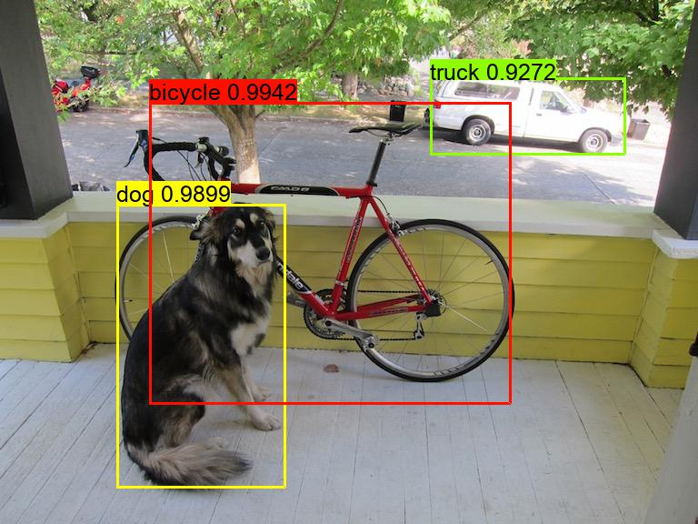

# Compile darknet on tvm

This is a demo of yolov3 on TVM. 

## Environments Setup

1. **Install TVM**

    1. Requirements
    
    ```
    sudo apt-get update 
    sudo apt-get install -y python3 python3-dev python3-setuptools gcc libtinfo-dev zlib1g-dev build-essential cmake libedit-dev libxml2-dev
    ```
    
    2. Download llvm pre-built binary from [here](http://releases.llvm.org/download.html) (depends on your OS)
    
    ###### unzip llvm directory under `tvm-yolov3/`
    
    3. Compile (modify `build/cmake.config` if needed)
    
    ```
    cd build/ && cmake ..
    make -j8
    ```
    
    4. Install Python required packages
    
    `pip install -r requirements.txt`
    
    > for other TVM intallation issues please refer to the [website](https://docs.tvm.ai/install/from_source.html)
    
2. **Prepare Data**

    1. Download yolov3 [weights](https://pjreddie.com/media/files/yolov3.weights) and unzip it under `tvm-yolov3/`

## Run and Testing

```
import tvm.relay.frontend.yolov3 as yolov3

config = { 
    'image_path': 'test.jpg',
    'cfg_path': 'yolov3.cfg',
    'weights_path': 'yolov3.weights',
    'device_type': 'cuda-cudnn',            # device_type: llvm / cuda / cuda-cudnn
    'autotune': True,                       # autotune: True / False
    'log_file': 'yolov3_auto.log',
    'thresh': 0.5,
    'nms_thresh': 0.45
}

dets = yolov3.run(config)
print(dets)
```

* Sample Output: (bbox coordinates with confidences and label)

```
[{'left': 0, 'right': 825, 'top': 180, 'bot': 691}, {'left': 464, 'right': 558, 'top': 190, 'bot': 443}, {'left': 274, 'right': 389, 'top': 129, 'bot': 462}, {'left': 213, 'right': 300, 'top': 130, 'bot': 374}, {'left': 10, 'right': 140, 'top': 95, 'bot': 409}]
```

> !!!   The fastest method is cuda with autotuning acceleration while you have to run `python autotuning.py` first to generate the log file.

> !!!   It takes times.

* Autotuning

`python autotuning.py`

```
Extract tasks...
Tuning...
[Task  1/12]  Current/Best:  598.05/2497.63 GFLOPS | Progress: (252/252) | 1357.95 s Done.
[Task  2/12]  Current/Best:  522.63/2279.24 GFLOPS | Progress: (784/784) | 3989.60 s Done.
[Task  3/12]  Current/Best:  447.33/1927.69 GFLOPS | Progress: (784/784) | 3869.14 s Done.
[Task  4/12]  Current/Best:  481.11/1912.34 GFLOPS | Progress: (672/672) | 3274.25 s Done.
[Task  5/12]  Current/Best:  414.09/1598.45 GFLOPS | Progress: (672/672) | 2720.78 s Done.
[Task  6/12]  Current/Best:  508.96/2273.20 GFLOPS | Progress: (768/768) | 3718.75 s Done.
[Task  7/12]  Current/Best:  469.14/1955.79 GFLOPS | Progress: (576/576) | 2665.67 s Done.
[Task  8/12]  Current/Best:  230.91/1658.97 GFLOPS | Progress: (576/576) | 2435.01 s Done.
[Task  9/12]  Current/Best:  487.75/2295.19 GFLOPS | Progress: (648/648) | 3009.95 s Done.
[Task 10/12]  Current/Best:  182.33/1734.45 GFLOPS | Progress: (360/360) | 1755.06 s Done.
[Task 11/12]  Current/Best:  372.18/1745.15 GFLOPS | Progress: (360/360) | 1684.50 s Done.
[Task 12/12]  Current/Best:  215.34/2271.11 GFLOPS | Progress: (400/400) | 2128.74 s Done.
Compile...
Evaluate inference time cost...
Mean inference time (std dev): 3.16 ms (0.03 ms)
```

## Results: (RTX 2080 Ti)

|               | Darknet        | TVM           | AutoTVM      |
|-------------  | -------------: |:-------------:| -------:     |
|cuda10.2       | ~300ms      | ~170ms        | **7~8ms**    |
|cuda10.2+cudnn7| ~13ms          | 8~9ms         |   -          |




## Reference

https://tvm.apache.org
